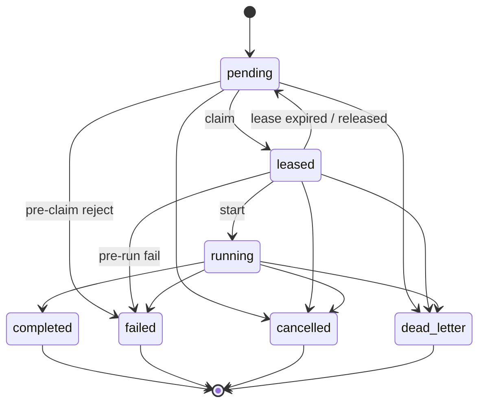

# ADR 0004: `AgentCommand` lifecycle — states, transitions, lease, retries

**Status:** Accepted  
**Date:** 2026-04-19

## Context

Durable commands are the **spine of coordination**: leasing, idempotency, operator honesty, and auditability all assume **one** shared lifecycle. If Rust, TypeScript, and the database disagree on legal transitions—or if “almost the same” states are overloaded—workers double-run work, commands get stuck, or evidence stops matching rows.

Today the **state vocabulary** is fixed (`pending`, `leased`, `running`, `completed`, `failed`, `cancelled`, `dead_letter`) and mirrored in [`minilab_core::command::AgentCommandStatus`](../../rust/crates/minilab-core/src/command.rs). What was missing is a **single normative transition contract**: who may move which edge, how lease expiry behaves, and how retries relate to terminals.

## Decision

### States (exhaustive for M0)

| Persisted string (`agent_commands.status`) | Meaning (short)                                                                                                                  |
| ------------------------------------------ | -------------------------------------------------------------------------------------------------------------------------------- |
| `pending`                                  | Durable work exists; **no valid lease** holds execution authority (lease absent or treated as expired by policy).                |
| `leased`                                   | A worker holds an active **claim** (`lease_expires_at`, `worker_instance_id` per migration); execution may not have started yet. |
| `running`                                  | Executor has started **typed** work for this command.                                                                            |
| `completed`                                | **Terminal** — success.                                                                                                          |
| `failed`                                   | **Terminal** — work attempted, outcome is failure (retry = **new** command row unless a future ADR says otherwise).              |
| `cancelled`                                | **Terminal** — intentionally stopped (operator/system).                                                                          |
| `dead_letter`                              | **Terminal** — will not be executed successfully without **human replanning** (poison, policy cap, irreversible validation).     |

**Non-exhaustive enums in code** (`#[non_exhaustive]` on `AgentCommandStatus`) stay allowed for forward-compatible parsing; **new** persisted strings require an ADR + crosswalk update.

### Lease interaction

- **Claim:** `pending` → `leased` when a worker successfully sets lease fields (atomic claim in `CommandRepository` / SQL).
- **Expiry / release:** `leased` → `pending` when the lease is **no longer authoritative** (expired, explicitly released, or superseded by a documented reclaim path). Lease changes **must** produce rows in **`minilab.agent_command_lease_events`** (see ADR 0005 / [M0 event map](../milestones/M0-event-map.md)), not only freeform command text.
- **Start execution:** `leased` → `running` when the executor acknowledges start (may be immediate after claim).
- **Illegal:** `pending` → `running` or `pending` → `completed` (must pass through `leased` → `running` for executed work).

**Exception — pre-claim rejection:** `pending` → `failed` is allowed when policy rejects the command **before** any lease is granted (validation, capability, or safety). No `running` phase.

**Exception — post-claim, pre-run failure:** `leased` → `failed` is allowed when the worker determines the command cannot be executed **before** entering `running` (deterministic irreversible failure at claim edge).

### Cancellation

- `pending` → `cancelled` — operator/system before claim.
- `leased` → `cancelled` — allowed; must emit lease narrative consistent with ADR 0005.
- `running` → `cancelled` — cooperative cancel; executor stops side effects as policy allows.

### Dead letter

- `dead_letter` is terminal. Enter from `pending`, `leased`, or `running` when the command must **not** be retried automatically and is not a normal `failed` outcome (e.g. poison payload, operator-marked abandon, policy cap). Exact automation for “max attempts” is **implementation** in M1+; this ADR only fixes **graph edges** and terminality.

### Retries and timing

- **Lease renewal** and heartbeat timing are **operational policy** (not fixed here) but **must not** silently rewrite terminals.
- **After `failed`:** default is **new command row** (new identity / idempotency policy per product). **Re-opening** a `failed` row is **rejected** unless a future ADR and migration explicitly allow it.

### Transition summary (matrix)

From non-terminal states only; terminals **only** allow `self` (idempotent no-op replay).

| From ↓ / To → | `pending` | `leased` | `running` | `completed` | `failed` | `cancelled` | `dead_letter` |
| ------------- | --------- | -------- | --------- | ----------- | -------- | ----------- | ------------- |
| `pending`     | ✓         | ✓        | ✗         | ✗           | ✓        | ✓           | ✓             |
| `leased`      | ✓         | ✓*       | ✓         | ✗           | ✓        | ✓           | ✓             |
| `running`     | ✗         | ✗        | ✓         | ✓           | ✓        | ✓           | ✓             |

`leased` → `leased` only as **idempotent replay** of the same claim (no semantic change); new claims from another worker must go through `pending` first.

### Diagram

## Authority ordering (review discipline)

- This ADR is **normative** for the command lifecycle **once Accepted**.
- [`AgentCommandStatus`](../../rust/crates/minilab-core/src/command.rs) and [`command_transition_allowed`](../../rust/crates/minilab-core/src/command.rs) **MUST** match this ADR; drift is a **merge blocker** when the ADR is Accepted (or explicitly cited as Proposed in a PR checklist).
- Domain model prose ([§4 AgentCommand](../minilab-persistence-domain-model.md)) stays **descriptive**; on conflict after Acceptance, **update prose to match ADR**, not the reverse.
- **M1 migrations** may enforce a subset (valid enum literals); **full** transition validation remains the job of `CommandRepository` (Rust) at minimum until triggers exist.

## Consequences

**Positive**

- One graph for workers, UI, and reviewers; lease expiry is explicit (`leased` → `pending`).
- Terminals are stable; retries default to **new rows**, preserving audit history.

**Negative / trade-offs**

- Some products prefer `failed` → `pending` retries; that is **explicitly rejected** here to keep history legible—revisit only with a new ADR.

## Links

- Crosswalk: [M0-crosswalk.md](../milestones/M0-crosswalk.md)
- Contract stub: [state-machine.md](../../contracts/commands/state-machine.md)
- Domain: [minilab-persistence-domain-model.md](../minilab-persistence-domain-model.md) §4–§5.1
- GitHub: [#4](https://github.com/danvoulez/minilab-cursor/issues/4)

## Changelog

| Date       | Change                                                          |
| ---------- | --------------------------------------------------------------- |
| 2026-04-19 | Proposed: states, transitions, lease, retries, authority order. |
| 2026-04-18 | Accepted — M0 first-pass disposition ([matrix](../milestones/M0-ADR-outcome-matrix.md)). |
