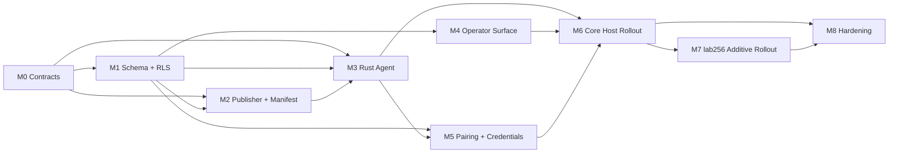

# Minilab production milestones

Execution pressure for [plan-production.md](plan-production.md). Each milestone has concrete scope, required outputs, a **hard gate**, dependencies, and owner slots (fill when capacity is known).

**Do not add dates until real capacity is known.**

**When is a milestone really done?** See [definition-of-done-and-quality-control.md](definition-of-done-and-quality-control.md) (milestone DoD, PR DoD, QC checklists, merge blockers).

---

## M0 — Freeze shared contracts

**Goal:** one meaning across Rust, TS, DB, and docs.

**Status:** **M0 semantics closed** — [ADRs 0001–0006](adr/0001-verify-results-semantics.md) **Accepted**; disposition [Passed](milestones/M0-ADR-outcome-matrix.md). Remaining checklist items are **implementation** (TS packages, migrations), not open contract meaning.

### Includes

- `ManifestSnapshot` contract
- signed-bytes vs envelope rule
- canonicalization rule
- `AgentCommand` state machine
- typed event contracts
- pairing/auth envelope
- `verify_results` decision
- reconciliation ownership rule

### Outputs

- real contract artifacts replacing placeholder prose
- Rust core types aligned
- TS contract/types aligned
- docs link to canonical artifacts, not duplicate them

### Gate

- no important contract exists only in a stub file
- Rust names, TS names, DB names, and docs names match for:
  - manifest
  - command states
  - event types
  - pairing/auth shapes

### Depends on

- none

### Owners

- Rust:
- TS:
- Schema/docs:

**Execution checklist:** [milestones/M0-checklist.md](milestones/M0-checklist.md) (GitHub-ready issues + gates).

---

## M1 — Production-shaped schema and RLS

**Goal:** real persistence matches the domain model.

**First execution slice:** [M1-A — command vertical checklist](milestones/M1-A-command-vertical-checklist.md) (persist → claim → lease event → typed execute → command event → inspect). Start here before broadening M1 scope.

### Includes

- `minilab` schema tables
- publication truth tables
- evidence streams
- read-model support surfaces
- public RPC edge
- constraints and FKs
- initial RLS

### Outputs

- applied migrations in staging Supabase
- host/message/command relationship constraints
- append-only evidence discipline
- thin public RPC docs linked to real SQL

### Gate

- migrations apply cleanly in staging
- smoke tests run against real project URL
- runtime fetch does not require publication table walks
- command claim path exists and is testable

### Depends on

- M0

### Owners

- Schema:
- Auth/RLS:
- Review:

---

## M2 — Publisher and manifest pipeline

**Goal:** releases become repeatable verified runtime truth.

### Includes

- publication rows → snapshot assembly
- canonicalization
- hash
- sign
- publish to `manifest_snapshots`
- `rpc_get_current_manifest`
- channel support
- preflight checks

### Outputs

- publisher pipeline in TS
- signing flow documented and implemented
- stable channel with rollback-compatible previous snapshot history

### Gate

- fresh bootstrap can fetch manifest from RPC and verify locally
- manifest mismatch fails closed
- no runtime dependency on normalized publication graph

### Depends on

- M0
- M1

### Owners

- Publisher:
- Signing:
- Verification mirror:

---

## M3 — Rust agent core

**Goal:** one host can operate without UI help.

### Includes

- polling loop
- Realtime wake path
- durable reread recovery
- claim / lease / renew / release
- typed execution path only
- evidence emission
- manifest fetch + verify
- host identity + credential use

### Outputs

- working Rust agent build
- claim/lease implementation
- typed operation executor
- structured logging with correlation IDs
- append-only command and lease evidence

### Gate

- kill agent during leased command
- lease expires or is recoverable
- command becomes reclaimable
- no duplicate side effects under retry/idempotency rules

### Depends on

- M0
- M1
- M2

### Owners

- Agent/runtime:
- Execution:
- Evidence/observability:

---

## M4 — TypeScript operator surface

**Goal:** one honest human interface over persisted truth.

### Includes

- server-side reads
- durable thread/message creation
- enqueue command flow
- idempotency at boundary
- command inspection
- Places projection
- host detail and trace surfaces

### Outputs

- operator UI that follows persisted rows
- read models for:
  - Places
  - host summaries
  - thread inspect
  - command inspect

### Gate

- operator can follow one command end-to-end:
  - enqueue
  - claimed
  - leased
  - events emitted
  - completed/failed
- UI does not imply truth beyond persisted evidence

### Depends on

- M1
- M3 partially, for useful inspection

### Owners

- UI:
- Read models:
- Operator flows:

---

## M5 — Pairing and credential ceremony

**Goal:** hosts enter the system soberly, not by hidden manual magic.

### Includes

- pairing session lifecycle
- pairing events
- host-scoped credentials
- challenge / reclaim flow
- credential rotation/revoke surface
- bootstrap config path

### Outputs

- real pairing path in Rust + TS orchestration
- persisted ceremony evidence
- documented credential lifecycle

### Gate

- a new host can pair from scratch
- it receives usable host-scoped credentials
- it can fetch verified runtime truth
- failed or mismatched pairing closes explicitly, not vaguely

### Depends on

- M0
- M1
- M3
- M4 for UX, optionally partial

### Owners

- Pairing/runtime:
- UX/bootstrap:
- Security/review:

---

## M6 — Core host rollout

**Goal:** prove the topology is real.

### Includes

- lab8gb deployment
- lab512 deployment
- Doppler wiring
- service install
- manifest bootstrap
- agent supervision
- extended absence test for lab256

### Outputs

- 24/7 agents on core hosts
- manifest-driven operation on both
- evidence and inspection visible in operator surface

### Gate

- lab8gb and lab512 continue to:
  - fetch verified manifest
  - claim/execute commands
  - emit evidence
  - remain inspectable
- while lab256 is absent for an extended period

### Depends on

- M2
- M3
- M4
- M5 preferably, if pairing is the real entry path

### Owners

- Host ops:
- Agent deploy:
- Inspection validation:

---

## M7 — lab256 additive rollout

**Goal:** add the laptop without making it secretly sovereign.

### Includes

- lab256 join path
- human interface usage
- optional extra execution capacity
- topology validation

### Outputs

- lab256 integrated as additive-only node
- no hidden dependency on it for continuity

### Gate

- removing lab256 again does not break:
  - manifest fetch
  - command execution
  - coordination truth
  - operator continuity on core hosts

### Depends on

- M6

### Owners

- Laptop integration:
- Topology validation:

---

## M8 — Production hardening

**Goal:** make failure boring and contracts durable.

### Includes

- key rotation story
- DB credential rotation
- backup/restore drills
- dead-letter monitoring
- lease expiry monitoring
- manifest verify failure alerts
- retry-rate monitoring
- restore of operational memory, not just rows

### Outputs

- hardening runbooks
- alert thresholds
- backup/restore validation
- fail-closed behavior tested

### Gate

- restore drill proves recovery of:
  - commands
  - command events
  - lease events
  - manifest snapshot history
  - install/verify history
- compromised or stale manifest is rejected
- monitoring catches contract breakage signals

### Depends on

- M6
- M7 ideally

### Owners

- Ops:
- Monitoring:
- Backup/DR:
- Security:

---

## Dependency map

---

## Minimal critical path

Shortest path to “this is becoming real”:

1. M0 Contracts  
2. M1 Schema + RLS  
3. M2 Publisher + Manifest  
4. M3 Rust Agent  
5. M5 Pairing + Credentials  
6. M6 Core Host Rollout  
7. M8 Hardening  

M4 can move in parallel after M1 starts stabilizing, but it **must not define the system**.

---

## Suggested issue breakdown per milestone

Each milestone should probably have **three** issue types:

| Type | Purpose |
| ---- | ------- |
| **Contract** | define shape; define names; link DB / Rust / TS; remove placeholder ambiguity |
| **Implementation** | build; test; emit evidence; wire inspection |
| **Gate** | one issue per exit test; milestone cannot close without passing |

### Example board columns

- Backlog  
- Contract frozen  
- In implementation  
- In staging  
- Gate test running  
- Done  

### Board rule

**A milestone is not done when code exists; it is done when the gate passes on real infrastructure.**

---

## Changelog

| Date | Change |
| ---- | ------ |
| 2026-04-18 | Initial milestones M0–M8, dependency map, issue taxonomy. |
