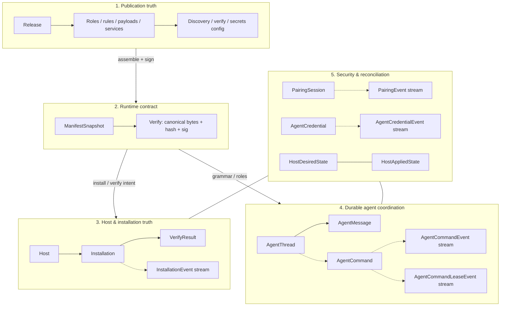
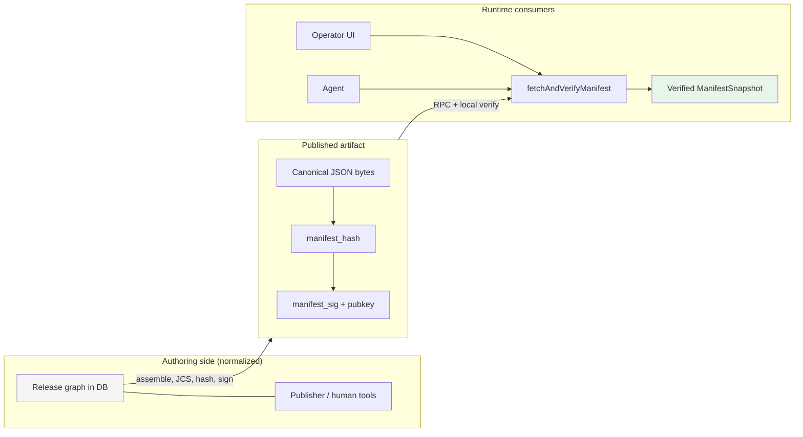
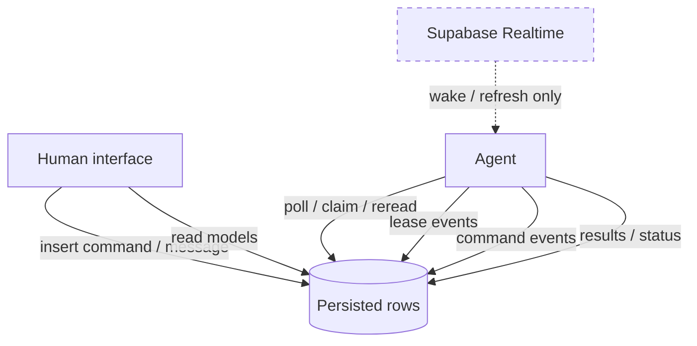
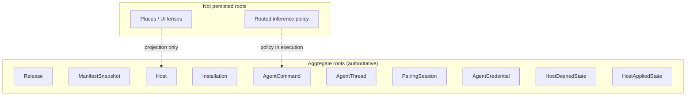

# Minilab persistence and domain model

Boundary-first modeling note aligned to the project README. This file defines how Minilab persistence should be understood: not as one generic application database, but as **five distinct persistence domains** carrying different kinds of truth, different evidence streams, and different failure modes.

Minilab should be modeled from its **contract boundaries**, not from generic architectural elegance. If those boundaries leak, the project becomes mushy. If they remain hard, the system can grow without losing its shape.

---

## 0. Diagrams

### 0.1 Five persistence domains (trust and truth)

### 0.2 Hard boundary: publication → runtime

**Rule:** runtime code does not walk publication tables for “what to do”; it consumes **one verified snapshot**.

### 0.3 Coordination spine (durable truth vs wake-up)

### 0.4 Aggregates (narrow roots)

---

## 1. Three modeling rules

### 1.1 Use the project’s own structure first

Minilab already partitions persistence into five real domains. Modeling should begin from those domains, not invent a parallel taxonomy that looks cleaner on paper but drifts from the actual system.

### 1.2 Every table has exactly one role

Every persisted structure must be exactly one of:

- authoritative state,
- append-only evidence,
- read model / presentation.

No table should silently play two roles at once.

### 1.3 Runtime truth stays separate from authoring truth

Normalized publication rows are for authoring and publishing. Signed manifest snapshots are for runtime. If runtime code starts traversing authoring tables directly, the contract boundary is already weakening.

---

## 2. Five persistence domains

| Domain                         | Job (one line)                                                                                      |
| ------------------------------ | --------------------------------------------------------------------------------------------------- |
| 1. Publication truth           | Author, normalize, inspect, and publish releasable intent.                                          |
| 2. Runtime contract            | Deliver one canonical, signed, verified snapshot for runtime use.                                   |
| 3. Host and installation truth | Persist what is true about real hosts, applied artifacts, and verification outcomes.                |
| 4. Durable agent coordination  | Persist durable work, human/agent context, claims, leases, retries, and inspectable execution flow. |
| 5. Security and reconciliation | Persist trust establishment, credential lifecycle, and desired/applied reconciliation surfaces.     |

### 2.1 Publication truth

This is the authoring side of the system. It includes normalized release material: roles, rules, payloads, services, discovery, verify, and secrets configuration. Its job is editorial and compositional, not runtime execution.

### 2.2 Runtime contract

This domain is centered on `ManifestSnapshot`. It is the trust boundary. Runtime consumers should receive a canonical, signed snapshot plus enough metadata to verify it locally.

### 2.3 Host and installation truth

This domain captures real machine state and applied outcomes: hosts, installations, verification results, and their evidence streams.

### 2.4 Durable agent coordination

This domain is the spinal cord of multi-host operation: threads, messages, commands, command events, and lease events.

### 2.5 Security and reconciliation

This domain persists pairing, credential lifecycle, and the explicit desired/applied state surfaces used by reconciliation.

---

## 3. Table roles (every table: exactly one)

### A. Authoritative state

| Table                | Aggregate root   | Notes                                                                                               |
| -------------------- | ---------------- | --------------------------------------------------------------------------------------------------- |
| `releases`           | Release          | Authoring root for publication truth.                                                               |
| `manifest_snapshots` | ManifestSnapshot | Runtime contract root; verified snapshot boundary.                                                  |
| `hosts`              | Host             | Current persisted host identity and operational summary.                                            |
| `installations`      | Installation     | Current lifecycle summary for one install context.                                                  |
| `agent_threads`      | AgentThread      | Durable human/agent coordination root.                                                              |
| `agent_messages`     | AgentThread      | Durable append-only child of thread; message rows are conversational state, not execution evidence. |
| `agent_commands`     | AgentCommand     | Durable work root with lifecycle and lease state.                                                   |
| `pairing_sessions`   | PairingSession   | Pairing ceremony state, not just a flag on host.                                                    |
| `agent_credentials`  | AgentCredential  | Credential lifecycle root.                                                                          |
| `host_desired_state` | HostDesiredState | Persisted intended target for reconciliation.                                                       |
| `host_applied_state` | HostAppliedState | Persisted applied-state summary grounded in evidence.                                               |

### B. Append-only evidence

| Table                        | Event types (Rust enum / TS union)                         | Notes                                                                                    |
| ---------------------------- | ---------------------------------------------------------- | ---------------------------------------------------------------------------------------- |
| `installation_events`        | `InstallationEvent`                                        | Historical narrative of install activity.                                                |
| `verify_results`             | `VerifyResultEvent` or equivalent immutable attempt record | Treat immutable attempts as evidence; if a latest-summary view exists, keep it separate. |
| `agent_command_events`       | `AgentCommandEvent`                                        | Execution narrative for commands.                                                        |
| `agent_command_lease_events` | `AgentCommandLeaseEvent`                                   | Dedicated stream for claim / renew / release evidence.                                   |
| `pairing_events`             | `PairingEvent`                                             | Pairing ceremony history.                                                                |
| `agent_credential_events`    | `AgentCredentialEvent`                                     | Credential issuance / revoke / rotate history.                                           |

**`verify_results` semantics (load-bearing):** one row per **immutable verify attempt** → this table is **evidence**. A mutable “latest verification summary” for an installation is **authoritative state** and must be a **separate** surface (or a strictly defined derived view), not the same rows serving both roles. Mixing without an explicit rule is how this domain turns mushy.

### C. Read model / presentation

| View or table             | Rebuild from                                                                        | Notes                                       |
| ------------------------- | ----------------------------------------------------------------------------------- | ------------------------------------------- |
| places / place read model | Hosts, installations, desired/applied state, command status, verification summaries | Projection only; never backend sovereignty. |
| host summaries            | Hosts + installations + verify results + recent command state                       | Operator inspection.                        |
| thread inspect views      | Threads + messages + commands + events                                              | Human-facing continuity surface.            |
| command inspect views     | Commands + command events + lease events                                            | Explain execution and liveness.             |

**Places are a projection, not a root.**

---

## 4. Aggregates in use

| Root             | Key invariant                                                                                                                                                                                                                                                                                       | Code path (Rust)                                 | Code path (TS)                                            |
| ---------------- | --------------------------------------------------------------------------------------------------------------------------------------------------------------------------------------------------------------------------------------------------------------------------------------------------- | ------------------------------------------------ | --------------------------------------------------------- |
| Release          | Runtime consumers never traverse release rows directly for execution truth.                                                                                                                                                                                                                         | None or tooling-side verification helpers only   | Publisher, release authoring, manifest assembly tooling   |
| ManifestSnapshot | Canonicalize, hash, and verify signature; fail closed on mismatch.                                                                                                                                                                                                                                  | Agent manifest fetch/verify path                 | Publish-time assembly, operator inspection, fetch wrapper |
| Host             | Identity is cryptographic first; hostname and labels are metadata.                                                                                                                                                                                                                                  | Agent identity, facts, heartbeat, observed state | Read models, operator UI, host detail views               |
| Installation     | Summary row is not the movie; event streams and verify attempts explain what happened.                                                                                                                                                                                                              | Install executor, verify logic                   | Inspection UI, summaries                                  |
| AgentCommand     | Commands are durable work with explicit lifecycle and typed execution semantics.                                                                                                                                                                                                                    | Claim / lease / execute / complete               | Command creation, operator flows, thread linkage          |
| AgentThread      | Root for durable human/agent coordination. `AgentMessage` is its append-only child entity (authoritative rows), with dedupe via client message identity and optional linkage into command creation through `origin_message_id`. Thread is durable context, not runtime truth or execution backbone. | Optional agent-side thread awareness             | Chat UI, operator continuity                              |
| PairingSession   | Pairing is a ceremony with explicit state transitions and evidence.                                                                                                                                                                                                                                 | Pair / reclaim / challenge verify                | Pairing UX, bootstrap flow                                |
| AgentCredential  | Credentials have lifecycle and evidence, not just latest flags.                                                                                                                                                                                                                                     | Credential validation / rotate / revoke          | Operator inspection, ceremony support                     |
| HostDesiredState | Desired state must be explicitly owned and not drift into vague convenience data.                                                                                                                                                                                                                   | Reconciliation input                             | Read/inspect, operator intent surfaces                    |
| HostAppliedState | Applied state must be grounded in host/install evidence, not vibes.                                                                                                                                                                                                                                 | Reconciliation output / summary                  | Inspection views, drift UI                                |

---

## 5. Explicit invariants

| ID  | Invariant                                                                         | Fails how (build / runtime / review) | Owner     |
| --- | --------------------------------------------------------------------------------- | ------------------------------------ | --------- |
| 1   | Runtime clients consume verified manifest snapshots, not publication graph walks. | Review + runtime boundary violations | Rust + TS |
| 2   | Canonicalization, hash, signature verification fail closed.                       | Runtime                              | Rust      |
| 3   | No partial runtime truth.                                                         | Runtime                              | Rust      |
| 4   | Host identity is cryptographic first; hostname/labels are metadata.               | Review + runtime identity checks     | Rust      |
| 5   | Authority decisions do not rely on hostname alone.                                | Runtime + review                     | Rust      |
| 6   | Commands are durable work with explicit lifecycle.                                | Build/review/runtime                 | Rust + TS |
| 7   | Lease history is first-class evidence (dedicated stream).                         | Review + schema/runtime              | Rust + TS |
| 8   | Realtime is wake-up only; recovery via durable reread.                            | Runtime + review                     | Rust      |
| 9   | Append-only evidence is immutable in meaning.                                     | Schema/review                        | Rust + TS |
| 10  | Installation/command rows summarize; streams explain.                             | Review + UI drift                    | TS        |
| 11  | Places are read models only.                                                      | Review                               | TS        |
| 12  | Read models do not become authoritative roots.                                    | Review + schema discipline           | Rust + TS |
| 13  | Execution uses typed validated operations, not raw payload semantics.             | Build + runtime                      | Rust      |
| 14  | Execution edge does not depend on UI language or publication traversal.           | Runtime + review                     | Rust      |
| 15  | Rust and TS may differ in implementation, not in domain meaning.                  | Build/review/shared contract checks  | Rust + TS |

### 5.1 Messages vs execution evidence

Messages are **durable thread children** (authoritative `agent_messages` rows), not generic event-log rows. **Execution evidence** belongs in command and lease streams, not in message history. Treating chat rows like telemetry blurs conversational artifacts with the inspectable execution movie.

---

## 6. Repository boundaries (ports)

| Port                       | Serves aggregate / contract | Forbidden                                                 |
| -------------------------- | --------------------------- | --------------------------------------------------------- |
| `ReleaseRepository`        | Release (authoring)         | Runtime fetch of “current truth”                          |
| `ManifestRepository`       | Verified snapshot           | Publication table walks                                   |
| `HostRepository`           | Host                        | Treating hostnames as stable identity                     |
| `InstallationRepository`   | Installation                | Explaining history only via summary row                   |
| `ThreadRepository`         | AgentThread                 | Smuggling execution truth into thread-only state          |
| `CommandRepository`        | AgentCommand                | Generic freeform progress without typed lifecycle methods |
| `PairingRepository`        | PairingSession              | Reducing pairing to host flags                            |
| `CredentialRepository`     | AgentCredential             | Hidden credential changes without event evidence          |
| `ReconciliationRepository` | Desired / applied state     | Vague ownership of writes from many callers               |

### 6.1 Port rule

Ports should be named after aggregates or contract surfaces, not after storage vendors. The most important example is `ManifestRepository`: it should serve verified runtime truth, not raw publication components.

---

## 7. Rust vs TypeScript ownership

| Concern                         | Rust (authoritative impl)          | TypeScript (authoritative impl)                | Shared contract artifact                               |
| ------------------------------- | ---------------------------------- | ---------------------------------------------- | ------------------------------------------------------ |
| Manifest verify                 | Yes                                | Publish-side preflight / inspection only       | `ManifestSnapshot`, signing envelope                   |
| Command claim / lease / execute | Yes                                | Command creation and inspection only           | `AgentCommand`, command state machine, lease events    |
| Grammar parse → Operation       | Runtime validation/execution shape | Human-facing parse / tooling / authoring shape | `Operation`, `IntentEnvelope`, typed grammar contracts |
| Pairing / credential ceremony   | Yes for trust-critical path        | UX / bootstrap orchestration                   | pairing envelope, credential event types               |
| UI / operator surfaces          | No                                 | Yes                                            | read-model contracts                                   |
| Manifest assembly (publish)     | No, except optional verify helpers | Yes                                            | publication graph → manifest assembly spec             |

### 7.1 Boundary rule

Rust is the operational core near the machine. TypeScript is the human surface, publishing surface, and inspection layer. They may duplicate implementation, but they must not diverge in meaning.

### 7.2 Contract sources

When semantics move, update these together so Rust, TypeScript, SQL, and prose stay aligned.

- **[M0 crosswalk](milestones/M0-crosswalk.md)** — concept ↔ Rust ↔ TypeScript ↔ database ↔ documentation mapping table.
- **ADRs** — [Architecture decision records](adr/README.md): verify-result semantics ([0001](adr/0001-verify-results-semantics.md)), reconciliation write ownership ([0002](adr/0002-reconciliation-write-ownership.md)), manifest signed bytes vs envelope ([0003](adr/0003-manifest-signed-bytes-vs-envelope.md)).
- **`minilab-core` (Rust)** — under `../rust/crates/minilab-core/src/`: `command` (`AgentCommandStatus` and string round-trip), `events` (Supabase `minilab.*` evidence stream table name constants), `manifest_envelope` (JSON envelope field-name constants aligned to ADR 0003).

---

## 8. Typed event streams (no mega-bus)

- `InstallationEvent` → `minilab.installation_events`
- `AgentCommandEvent` → `minilab.agent_command_events`
- `AgentCommandLeaseEvent` → `minilab.agent_command_lease_events`
- `PairingEvent` → `minilab.pairing_events`
- `AgentCredentialEvent` → `minilab.agent_credential_events`

### 8.1 Rule

Minilab should not collapse all evidence into one mega-bus. Separate typed streams preserve legibility, ownership, and inspectability.

---

## 9. What is not a core persisted entity

### 9.1 Places

“Place” is a product term and a projection. It is a UI lens over real operational entities. It must not become a backend root just because it is a good word.

### 9.2 Realtime

Realtime is not truth, not queue, and not delivery guarantee. It is wake-up infrastructure only.

### 9.3 Routed inference

Routed inference is an architectural network contract and execution policy, not automatically its own persistence root. Do not invent a second command system prematurely.

### 9.4 Raw grammar text at the execution edge

Human-language input may exist at ingress, but execution must run on typed validated operations, not raw text semantics.

---

## 10. Next artifacts

Written decisions for the first three items below are captured in ADRs; **implementation** (migrations, ports, codegen, CI checks) remains ahead.

- **Manifest signing:** ADR [0003](adr/0003-manifest-signed-bytes-vs-envelope.md) — sign over canonical inner JSON bytes; envelope metadata handled per ADR. Rust: `minilab_core::manifest_envelope` field names as a starter hook.
- **`VerifyResult`:** ADR [0001](adr/0001-verify-results-semantics.md) — authoritative “latest” vs immutable evidence per attempt; implement in schema and repositories.
- **Reconciliation:** ADR [0002](adr/0002-reconciliation-write-ownership.md) — single port for desired/applied writes; implement in code.
- Link to Minilab schema migrations / ERD (M1+).
- Shared generated contract artifacts for Rust + TypeScript.
- Build-time contract conformance checks where practical.

---

## Changelog

| Date       | Change                                                                                         |
| ---------- | ---------------------------------------------------------------------------------------------- |
| 2026-04-18 | Scaffold created.                                                                              |
| 2026-04-18 | Canonical prose filled: domains, roles, aggregates, invariants, ports, Rust/TS ownership.      |
| 2026-04-18 | `agent_messages` as authoritative child of `AgentThread`; §5.1 messages vs execution evidence. |
| 2026-04-18 | §7.2 contract sources; §10 aligned to ADRs + `minilab-core` hooks. |

