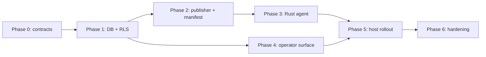

# Plan to production

Canonical narrative for how Minilab becomes **real**: preserved contracts under failure, not “features shipped.” The architecture note defines intent; **this** document defines what must be true to call the system production.

**Mindset:** you are shipping **continuity with proof**—inspectable operational memory, not chat or a control panel alone.

---

## Definition of production

Production is **not** “the UI opens.” It means:

- A host can **pair** and hold **host-scoped** credentials.
- A host can **fetch and verify** the current manifest (**fail-closed** on canonicalization, hash, or signature mismatch).
- A host can **claim** durable work with explicit **lease** semantics and **lease evidence**.
- The executor runs **only typed, validated operations**—**no command reaches the executor without becoming a typed validated operation.**
- Results and progress are written as **persisted evidence** (command events, lease events, install/verify evidence as designed).
- The operator can **inspect** threads, commands, leases, installs, and verification history **honestly** from **table rows**, not vibes.
- **lab8gb** and **lab512** remain able to **claim and execute commands** and operate in a **manifest-driven** way while **lab256 is absent for an extended period** (asymmetric availability is **testable**, not philosophical).
- **Supabase Realtime** is never required for correctness; **durable reread** is the recovery path.

Until those hold **against a real Supabase project, real migrations, a real Rust agent build, and a real operator surface**, Minilab remains **pre-production**.

---

## Phase 0 — Freeze semantics (contracts first)

**Goal:** one meaning across Rust, TypeScript, database, and docs. The SPEC tree must not become a second architecture: **no important rule exists only in a stub file**—stubs link to code/generated contracts or are retired.

| Step | Outcome |
|------|--------|
| **0.1 ManifestSnapshot** | Single written rule: **exactly which bytes are signed** vs envelope metadata; shared canonicalization (e.g. JCS); hash + Ed25519 verify; fail closed. |
| **0.2 AgentCommand** | State machine and fields aligned to DB; execution accepts **only** typed operations after validation. |
| **0.3 Typed events** | `InstallationEvent`, `AgentCommandEvent`, `AgentCommandLeaseEvent`, `PairingEvent`, `AgentCredentialEvent`—same semantics in Rust, TS, and persistence. |
| **0.4 Pairing / auth envelope** | Trust-critical shapes and ceremony documented; implemented in Rust near the host, orchestrated in TS for UX—**same meaning**. |
| **0.5 `verify_results`** | Decide: **immutable attempt rows (evidence)** vs **authoritative “latest” summary** (separate surface). Document and implement; do not mix roles without a written rule (see domain model §3B). |
| **0.6 Reconciliation** | **Single port** for `host_desired_state` / `host_applied_state` writes **or** an explicitly documented split—never fuzzy multi-caller updates. |

**Gate:** shared artifacts exist (codegen, crate, or package) and SPEC `contracts/` **points at** them instead of duplicating prose.

---

## Phase 1 — Database and RLS

**Goal:** persistence matches the domain model; thin public RPC edge only.

**Executable schema truth:** the **migration files** (and the live database they produce), **not** scaffold markdown under `references/schemas/`, are the authoritative definition of tables, constraints, and policies. Stubs are indexes and onboarding only.

| Step | Outcome |
|------|--------|
| **1.1 Migrations** | `minilab` schema + publication truth + coordination + security/reconciliation + append-only evidence; `public` RPCs for manifest and command claim as designed. |
| **1.2 Constraints** | Idempotency keys, `client_message_id`, thread/command/message **host agreement**, lease fields, FKs. |
| **1.3 RLS** | v0 breadth acceptable only with explicit risk acceptance; plan **host-scoped** credentials for agents/operators before “done-done.” |
| **1.4 Evidence discipline** | Append-only event streams; lease stream **separate** from command narrative. |

**Gate:** migrations applied to a **staging** Supabase project; smoke tests use **real** URLs and roles.

---

## Phase 2 — Publisher and manifest pipeline

**Goal:** repeatable, signed releases; runtime consumes **one verified snapshot**.

| Step | Outcome |
|------|--------|
| **2.1 Publication** | Normalized rows → assembled snapshot → canonical bytes → hash → sign → `manifest_snapshots` + `rpc_get_current_manifest`. |
| **2.2 Preflight** | Deploy preflight verifies signing keys, required files, and env—**fail before** half-real rollouts. |
| **2.3 Channels** | At least one channel (e.g. `stable`); prior snapshots remain verifiable for rollback discussion. |

**Gate:** fresh agent and operator bootstrap **only** via published bootstrap config + **verified** manifest RPC (no publication-table walks at runtime).

---

## Phase 3 — Rust agent (per host)

**Goal:** autonomous worker: wake, claim, execute, evidence—**no UI required**.

| Step | Outcome |
|------|--------|
| **3.1 Loop** | Poll + Realtime as wake-only; **always** reconcile from persisted rows. |
| **3.2 Claim / lease** | Transactional or RPC-backed claim; **AgentCommandLeaseEvent** (or equivalent) records claim/renew/release. |
| **3.3 Execution** | **No raw execution path:** ingress may carry text or JSON transport, but **the executor runs only typed validated operations**—reject or dead-letter otherwise. |
| **3.4 Observability** | Correlation IDs (command id, host id); logs do not replace append-only evidence. |

**Gate:** kill agent mid-command → lease expires → work **re-claimable** without duplicate side effects (idempotency holds).

---

## Phase 4 — TypeScript operator surface

**Goal:** one human interface; read models reflect DB truth.

**Anti-leak:** TS may **enqueue**, **inspect**, and **publish**, but **must not become the trusted executor of host actions**. Execution and trust boundary stay **in Rust on the host** (and in DB/RPC contracts), not in the browser or operator server as a secret control plane.

| Step | Outcome |
|------|--------|
| **4.1 Reads** | Trusted server-side Supabase for v0 only with explicit bootstrap caveat; path to real end-user auth documented. |
| **4.2 Chat / enqueue** | Durable messages; validation at boundary; commands created with idempotency and correct host targeting. |
| **4.3 Places** | Projection-only; no promotion to backend sovereignty. |

**Gate:** operator can trace **one command** from enqueue → lease → events → completion **using persisted rows**.

---

## Phase 5 — Host rollout

**Goal:** match fixed core vs additive laptop topology.

| Step | Outcome |
|------|--------|
| **5.1 lab8gb, lab512** | Agents run 24/7; manifest verify + worker + local policy; **extended drill:** core operates correctly with **lab256 offline**. |
| **5.2 lab256** | Joins for human interface and extra capacity; **must not** be required for manifest fetch, command execution, or coordination continuity. |

**Availability invariant (testable):** lab8gb and lab512 **continue command claim/execution and manifest-driven operation** while lab256 is absent for an **extended** period.

---

## Phase 6 — Production hardening

| Area | Minimum |
|------|---------|
| **Secrets** | Doppler (or chosen vault); rotation story for DB and signing keys. |
| **Backup and restore** | Supabase backup **and restore drill** that validates **operational memory**: **commands**, **event history**, **manifest snapshot history**—continuity is inspectable state, not only raw rows. |
| **Monitoring** | Manifest verify failures, lease expiry rates, dead_letter rates; alert on contract violations. |
| **DR** | Stale or compromised manifest rejected; agents fail closed per invariants. |

---

## Critical path

Publisher and agent depend on DB and frozen contracts; UI can track DB once read models stabilize—it must not **define** the system.

---

## SPEC workspace exit criterion

- **No important rule exists only in a stub file.**
- `references/schemas/*` **links** to real migrations or is regenerated from them.
- `contracts/` **links** to generated or canonical source types.
- Domain model and this plan stay aligned when contracts change.

---

## Execution pressure

Milestone breakdown (M0–M8), dependency map, issue taxonomy, and board rule: **[milestones-production.md](milestones-production.md)**.

---

## Changelog

| Date | Change |
| ---- | ------ |
| 2026-04-18 | Initial canonical plan; tightenings: migrations as truth, no raw executor, TS anti-control-plane, lab256 absence invariant, restore evidence/snapshots, no vanity timeboxes. |
| 2026-04-18 | Link to [milestones-production.md](milestones-production.md) for M0–M8 gates and issue breakdown. |
